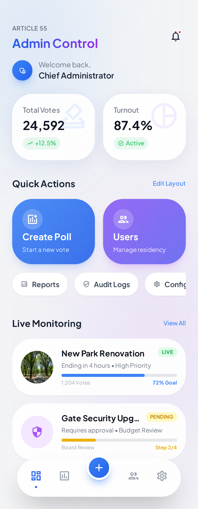

<div align="center">

# 🗳️ Article 55 – Fair Electoral System

**A production-grade, secure Flutter voting app for gated societies**

[](https://flutter.dev/)
[](https://dart.dev/)
[](.)
[](https://supabase.com/)
[](https://m3.material.io/)

*Phone login • RBAC • Candidate management • One-vote-per-flat • Live analytics • Blocked flat security • Glassmorphism UI*

</div>

---

## 🎯 Overview

Article 55 is a clean-architecture Flutter app that enables **secure, transparent digital voting** for gated societies. It covers the entire electoral pipeline — from user registration and candidate approval to category-based voting with one-vote-per-flat enforcement, real-time live results, full admin monitoring, and database-level security hardening.

---

## 📸 App Preview

| Splash Screen | Login Screen | Registration | User Dashboard | Admin Dashboard |
|---|---|---|---|---|
|  |  |  |  |  |

---

## 🏗️ App Architecture

```text
┌──────────────────────────────────────────────────────────────────────────────────┐
│                                Flutter App UI                                    │
│  Splash → Login ─┬→ User Dashboard ─┬→ Voting Screen (3 categories)             │
│                  │                  ├→ Candidate Form → Awaiting Approval        │
│                  │                  └→ Live Results (animated counters)          │
│                  └→ Admin Dashboard ─┬→ Candidate Approval Panel                │
│           ↕          (AdminGuard)    ├→ Vote Monitoring (search/filter/delete)   │
│      Registration                    ├→ Election Analytics (bar charts)          │
│                                      └→ Security Center (blocked flats)         │
└──────────────────────────────────┬───────────────────────────────────────────────┘
                                   │
                     Provider State Layer (7 providers)
      AuthProvider · CandidateProvider · VotingProvider · AdminProvider
      AdminDashboardProvider · VoteMonitoringProvider · SecurityProvider
                                   │
                   ┌───────────────┼───────────────┐
                   │               │               │
             AuthService    CandidateService   VotingService   AdminService
          (login/register)  (CRUD/approval)   (atomic votes/  (stats/monitor/
                   │               │            realtime)     blocked flats)
                   └───────────────┼───────────────┘
                                   │
                             Supabase DB
                  (users + candidates + votes + blocked_flats)
                   RLS policies · RPCs · SECURITY DEFINER
```

---

## ✨ Features

### 🔐 Authentication & Registration
- Phone number + passcode login (no OTP required)
- Role-based routing: `user` → User Dashboard, `admin` → Admin Dashboard
- Resident registration with name, block, flat, phone, email
- Phone and flat number uniqueness enforced at app + DB level
- Secure session handling with logout
- Demo mode for local testing without Supabase

### 🛡️ RBAC Route Guard
- `AdminGuard` widget wraps all admin routes
- Non-admin users redirected to `/login` on direct URL access
- Session-based protection via `AuthProvider.isAdmin`
- Prevents manual API tampering at DB level via RLS

### 🏛️ Candidate Management
- **Run for Office** — users submit candidature (name, category, summary)
- Live word count on summary field (max 300 words)
- Category selection: President, Secretary, Treasurer
- Candidates saved as `is_approved = false` until admin reviews
- Success screen shows "Awaiting Admin Approval" status

### ✅ Admin Approval Panel
- View all pending candidates with category badges
- One-tap approve / reject actions
- Pending count badge in top bar
- Empty state when all candidates are reviewed

### 🗳️ Voting System
- **Category-based tabs**: President · Secretary · Treasurer
- Approved candidates displayed as premium cards
- **Single-select mode**: pick one candidate per category
- Confirmation dialog before casting vote
- One-vote-per-flat-per-category enforced at DB level (`UNIQUE` constraint)
- Blocked flat detection — blocked flats rejected at cast time
- **Atomic vote casting** via Supabase RPC transaction
- "Already voted" badge per category after casting

### 📊 Live Results Dashboard
- Real-time vote counts via Supabase Realtime subscriptions
- Animated progress bars with percentage counters
- Candidates ranked by vote count with trophy badge for leader
- Category tabs to switch between results
- Green "Updating in real-time" indicator

### 📈 Admin Analytics
- Category-wise bar chart with animated progress bars
- Per-candidate vote distribution with rank badges
- Percentage breakdown per candidate
- Real-time auto-refresh
- No voter identity exposed in results

### 🔎 Vote Monitoring Panel
- Full vote log: user name, flat number, category, candidate, timestamp
- **Category filter** dropdown
- **Flat number search** field
- **Delete suspicious votes** with confirmation dialog
- Vote count stays consistent after deletions

### 🚫 Blocked Flats Security Center
- View all blocked flats with reason and timestamp
- **Block new flat** via FAB dialog (flat number + reason)
- **Unblock flat** to restore voting rights
- Blocked flats immediately prevented from voting (DB-enforced)
- Empty "All clear!" state when no flats blocked

### 📊 Admin Dashboard
- Animated count-up stat cards: Total Votes, Turnout %, Registered Users, Candidates
- Category distribution bars (President / Secretary / Treasurer)
- 4 Quick Action cards: Candidates, Votes, Analytics, Security
- Live monitoring section with election status and security status
- Refresh button for real-time stats

### 📊 User Dashboard
- Dynamic greeting based on time of day
- Verified Voter badge
- Active polls summary card (navigates to Voting Screen)
- **Quick Actions**: "Cast Your Vote" + "Run for Office" gradient cards
- Recent Polls carousel and Community Active section
- Custom bottom navigation bar

### 🎨 Premium Design System
- Material 3 with Plus Jakarta Sans + Cinzel typography
- Glassmorphism cards with translucent backgrounds
- Smooth fade+slide page transitions across all screens
- Dark theme support
- Custom reusable widgets: `GradientButton`, `CustomTextField`, `AnimatedCard`, `LoadingIndicator`, `RoleBadge`, `CandidateCard`, `VoteButton`, `CategoryTabBar`

---

## 🛠️ Technology Stack

| Category | Technology |
|---|---|
| **Framework** | Flutter (latest stable, null-safe) |
| **State Management** | Provider (7 providers) |
| **Backend** | Supabase (Postgres + Auth + Realtime + RPC) |
| **Database** | PostgreSQL with Row Level Security |
| **Typography** | Google Fonts (Plus Jakarta Sans, Cinzel) |
| **Architecture** | Clean Architecture (models → services → providers → screens) |
| **Design** | Material 3, Glassmorphism, Gradient animations |

---

## 📁 Project Structure

```text
lib/
 ├── main.dart                              # Entry point + dotenv load
 ├── app.dart                               # MaterialApp + 12 routes + 7 Providers + AdminGuard
 ├── config/
 │   └── env_config.dart                    # Reads .env via flutter_dotenv
 ├── core/
 │   ├── constants/
 │   │   ├── app_colors.dart                # Color palette + 5 gradients
 │   │   └── app_strings.dart               # All UI strings (70+)
 │   ├── theme/
 │   │   └── app_theme.dart                 # Light + Dark themes + page transitions
 │   └── utils/
 │       ├── validators.dart                # Phone, name, flat, email validators
 │       └── admin_guard.dart               # RBAC route guard widget
 ├── models/
 │   ├── user_model.dart                    # User model + JSON serialization
 │   ├── candidate_model.dart               # Candidate model + JSON serialization
 │   └── vote_model.dart                    # Vote model + VoteCount aggregate
 ├── services/
 │   ├── supabase_service.dart              # Supabase client init
 │   ├── auth_service.dart                  # Login / register / sign out + demo mode
 │   ├── candidate_service.dart             # Candidate CRUD + admin approval + demo mode
 │   ├── voting_service.dart                # Atomic voting + counts + realtime + blocked check
 │   └── admin_service.dart                 # Admin stats, vote records, blocked flats + demo mode
 ├── providers/
 │   ├── auth_provider.dart                 # Auth state (ChangeNotifier)
 │   ├── candidate_provider.dart            # Candidate creation state
 │   ├── voting_provider.dart               # Voting state + realtime subscription
 │   ├── admin_provider.dart                # Pending candidates + approve/reject
 │   ├── admin_dashboard_provider.dart      # Live admin stats
 │   ├── vote_monitoring_provider.dart      # Vote list + filter + search + delete
 │   └── security_provider.dart             # Blocked flats CRUD
 ├── screens/
 │   ├── splash_screen.dart                 # Animated splash + auto-navigate
 │   ├── login_screen.dart                  # Phone + passcode + role routing
 │   ├── registration_screen.dart           # Multi-field form + validation
 │   ├── user_dashboard_screen.dart         # Polls, quick actions, community
 │   ├── admin_dashboard_screen.dart        # Live stats, category bars, quick actions
 │   ├── candidate_form_screen.dart         # Run for Office form + success screen
 │   ├── admin_approval_screen.dart         # Pending candidate review panel
 │   ├── voting_screen.dart                 # Category-tabbed single-select voting
 │   ├── results_screen.dart                # Live animated results dashboard
 │   ├── vote_monitoring_screen.dart        # Admin vote log with filter/search/delete
 │   ├── admin_analytics_screen.dart        # Bar charts + candidate distribution
 │   └── blocked_flats_screen.dart          # Block/unblock flats security center
 └── widgets/
     ├── custom_text_field.dart             # Glassmorphic input field
     ├── gradient_button.dart               # Gradient CTA with loading state
     ├── animated_card.dart                 # Fade-in-up animated container
     ├── loading_indicator.dart             # Three-dot staggered animation
     ├── role_badge.dart                    # User/Admin role badge
     ├── candidate_card.dart                # Candidate info card with actions
     ├── vote_button.dart                   # Animated vote button
     └── category_tab_bar.dart              # President/Secretary/Treasurer tabs
```

---

## 🚀 Quick Start

### Prerequisites
- Flutter SDK (latest stable)
- Supabase project (optional — demo mode works without it)

### 1) Install dependencies

```bash
flutter pub get
```

### 2) Configure environment

Create a `.env` file in the project root:

```env
SUPABASE_URL=https://your-project.supabase.co
SUPABASE_ANON_KEY=your_supabase_anon_key
DEMO_MODE=true
```

> Set `DEMO_MODE=false` once your Supabase project is configured.

### 3) Setup Supabase database (optional)

Run the SQL files in the Supabase SQL Editor in order:

1. **`schema.sql`** — `users` table with RLS and seed data
2. **`schema_phase2.sql`** — `candidates` + `votes` tables, `cast_vote` RPC, `vote_counts` view
3. **`schema_phase3.sql`** — `blocked_flats` table, updated `cast_vote` RPC, admin stats/votes/delete RPCs

### 4) Run app

```bash
flutter run
```

---

## 🔑 Demo Credentials

| Role | Phone | Password |
|---|---|---|
| 👤 User | `9335946391` | `user@test` |
| 🛡️ Admin | `8947043315` | `admin@test` |

### Demo Mode Includes
- 6 pre-approved candidates (2 per category)
- Full voting flow with in-memory vote storage
- One-vote-per-flat enforcement
- Blocked flat prevention
- Admin dashboard with live stats
- Vote monitoring with delete capability
- Analytics bar charts

---

## 🔐 Security

| Constraint | Enforcement |
|---|---|
| Admin-only route access | `AdminGuard` widget (Flutter) |
| RBAC at DB level | RLS policies check `users.role = 'admin'` |
| One vote per flat per category | `UNIQUE(flat_number, category)` constraint |
| Atomic vote casting | `cast_vote` RPC with SECURITY DEFINER |
| Blocked flat prevention | `cast_vote` RPC checks `blocked_flats` table |
| Only approved candidates votable | RPC validates `is_approved = TRUE` |
| User-flat ownership | RPC validates `users.flat_number` match |
| Vote immutability | No UPDATE RLS policy on votes |
| Voter privacy | Users can only read their own votes |
| Admin-only flat blocking | RLS on `blocked_flats` (admin check) |
| Admin-only vote deletion | `delete_vote` RPC verifies admin role |
| Phone/flat uniqueness | App + DB level dual enforcement |
| Secrets protection | `.env` in `.gitignore` |

---

## 🧪 Quality Checks

```bash
flutter analyze    # Static analysis
flutter test       # Unit & widget tests
```

---

## 📐 Screen Routes

| Route | Screen | Access |
|---|---|---|
| `/` | Splash Screen | All |
| `/login` | Login Screen | All |
| `/register` | Registration Screen | All |
| `/user-dashboard` | User Dashboard | User |
| `/candidate-form` | Run for Office Form | User |
| `/voting` | Voting Screen | User |
| `/results` | Live Results Dashboard | All |
| `/admin-dashboard` | Admin Dashboard | 🔒 Admin |
| `/admin-approval` | Candidate Approval | 🔒 Admin |
| `/admin-votes` | Vote Monitoring | 🔒 Admin |
| `/admin-analytics` | Election Analytics | 🔒 Admin |
| `/admin-blocked` | Blocked Flats | 🔒 Admin |

---

## 🗺️ Roadmap

- [x] Authentication, registration, and role-based access
- [x] Premium UI/UX with glassmorphism design system
- [x] User and Admin dashboards with live stats
- [x] Candidate management with admin approval workflow
- [x] Category-based voting (President, Secretary, Treasurer)
- [x] One-vote-per-flat enforcement with atomic transactions
- [x] Live results dashboard with animated counters
- [x] Real-time vote updates via Supabase Realtime
- [x] RBAC route guard (AdminGuard)
- [x] Admin vote monitoring (filter, search, delete)
- [x] Admin analytics with bar charts
- [x] Blocked flats security system
- [x] Database security hardening (RLS, RPCs, constraints)
- [x] Demo mode for offline testing
- [ ] Biometric authentication
- [ ] PDF report generation
- [ ] Audit log viewer

---

<div align="center">

**Built for secure, transparent, and fair digital voting in gated communities.**

Made with ❤️ using Flutter & Supabase

</div>
